# Z-SpEx: Zero-shot Speaker Extraction with Multi-scale Interaction and Effective Cross-subnet Combination

### *Jun Chen, Wei Rao, Zilin Wang, Jiuxin Lin, Zhiyong Wu, Yukai Ju, Yannan Wang, Shidong Shang, Helen Meng*

<h2 id = "1">Abstract</h2>

Zero-shot speaker extraction aims at efficiently extracting the speech signal of an unseen speaker with only one reference utterance of the speaker. In this paper, we propose an extended speaker extraction framework called Z-SpEx with superior zero-shot capability. First, we present a multi-scale interaction (ScaleInter) fuser in Speaker Encoder to interactively fuse multi-scale features so as to improve the generalizability. In the same way, to enable the Speech Extractor to acquire greater generalization capacity, the ScaleInter fuser and ScaleInter mask generator are introduced to it for the interaction among multi-scale information. Furthermore, for the effective cross-subnet combination between Speech Extractor and Speaker Encoder, we share the weights of the ScaleInter fusers in them, as well as design a conditional speaker modulation (ConSM) module to effectively modulate and combine the features of these two subnets. Experimental results on the Libri2Mix dataset show that Z-SpEx yields a significant performance in extracting the speech signal of the unseen speaker and outperforms other state-of-the-art speech extraction approaches, which demonstrate the effectiveness of our improvements.

    
	
    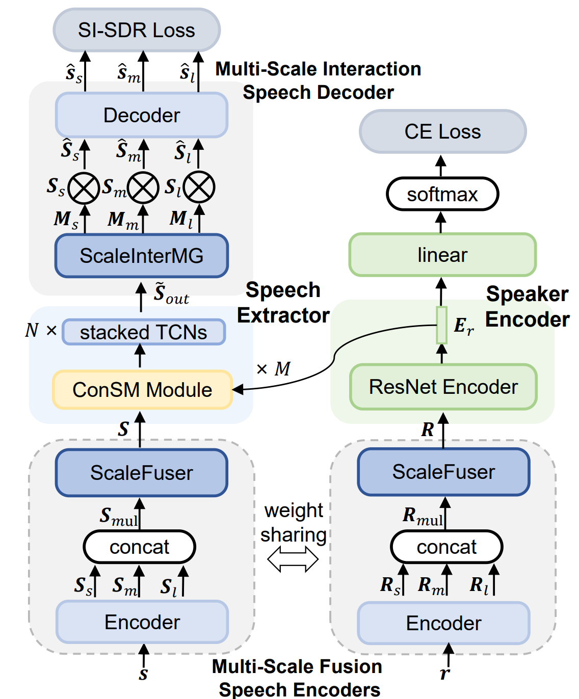
     
    
 Fig.1: The overall diagram of the Z-SpEx. The dotted border represents the module with shared weights. The "\(\otimes\)" means element-wise multiplication. The “SI-SDR Loss" and ”CE Loss" refer to the scale-invariant signal-to-distortion ratio loss and cross-entropy loss in multi-task learning.
    

## Speaker Visualization

For a more intuitive comparison, we visualized the speech of seen and unseen speakers extracted by SpEx+ and Z-SpEx respectively.  The speech extracted by the model is passed through the Speaker Encoder of the corresponding model to obtain the speaker embedding, which is then visualized by the t-SNE algorithm.  For each case, we prepared 6 speakers with 30 extracted speech for every speaker. All the cases are visualized at the same coordinate scale.

|                speaker visualization by t-SNE                |                                                              |
| :----------------------------------------------------------: | :----------------------------------------------------------: |
|                  **SpEx+ (seen speakers)**                   |                  **Z-SpEx (seen speakers)**                  |
| 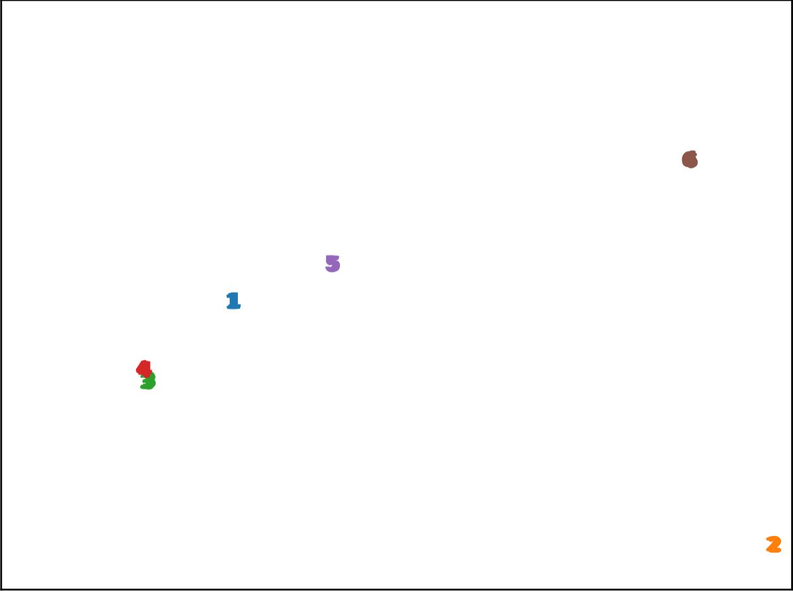 | 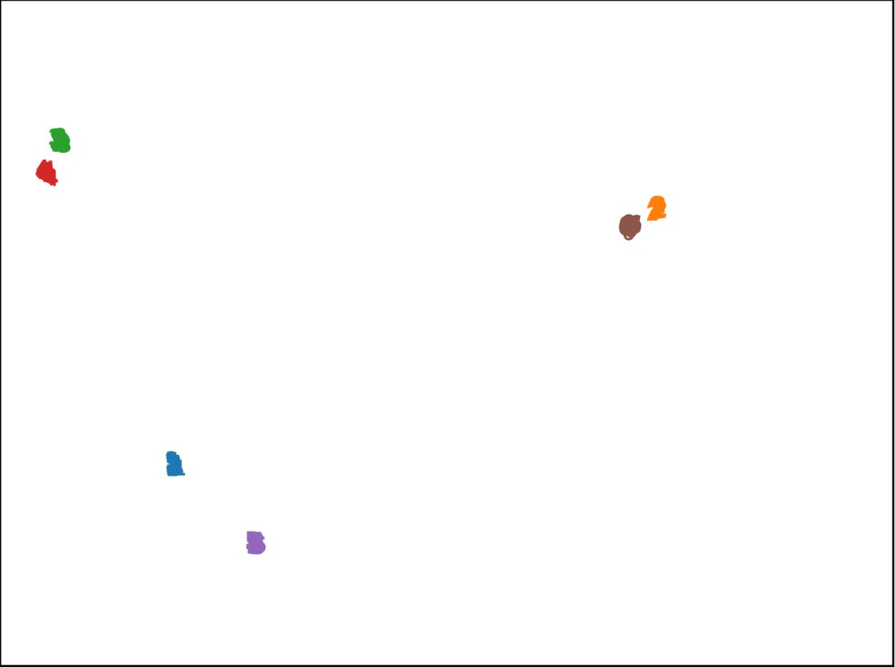 |
|                 **SpEx+ (unseen speakers)**                  |                 **Z-SpEx (unseen speakers)**                 |
| 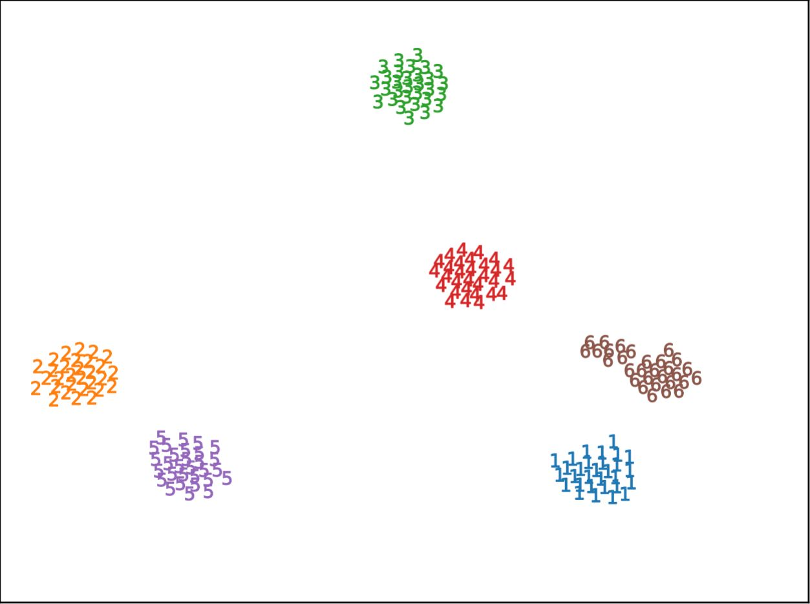 | 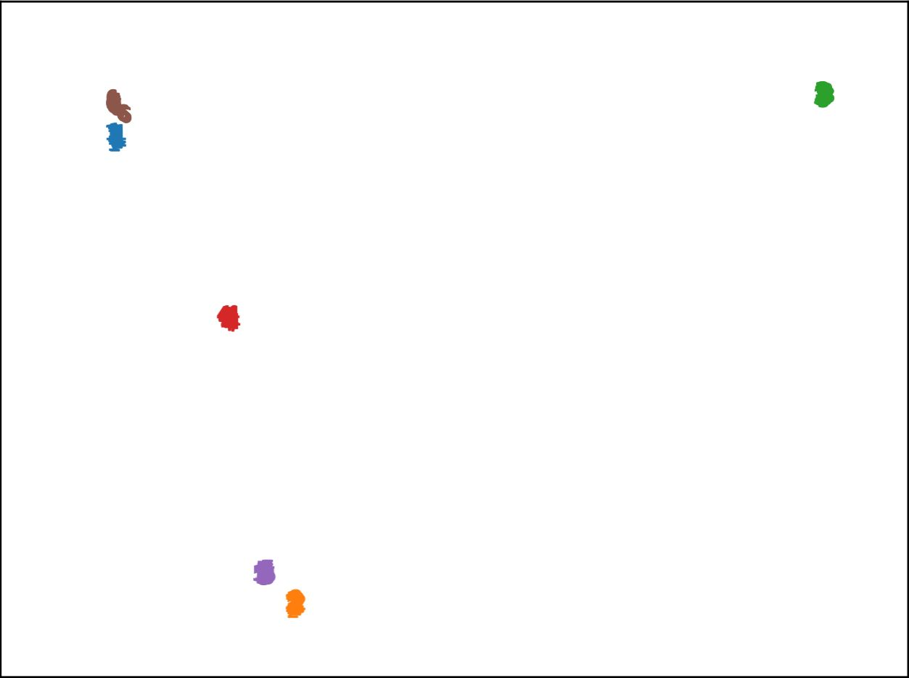 |

## Cases

We compare the performance of our proposed Z-SpEx and SpEx on Libri2Mix test set. In this test set, **all the speakers are unseen**. The cases are divided into "different gender" and "same gender", where "same gender" is further classified as "female mixed with female" and "male mixed with male".

<h3 id = "3">Different Gender</h3>

#### case 1

|                            case 1                            |                                                              |
| :----------------------------------------------------------: | :----------------------------------------------------------: |
| **Mixture**  <audio controls><source src="./data/diff_gen/case1/mix.wav" type="audio/wav">Your browser does not support the audio element.</audio> | **SpEx+**    <audio controls><source src="./data/diff_gen/case1/spex_plus.wav" type="audio/wav">Your browser does not support the audio element.</audio> |
| 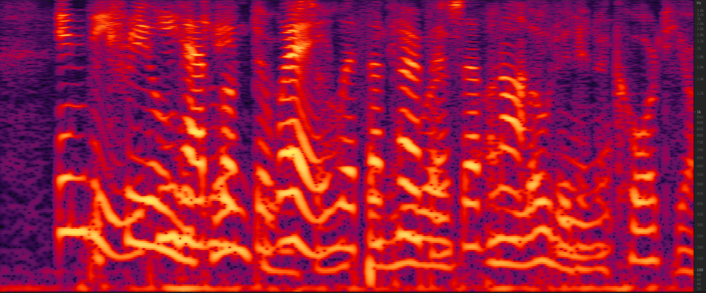 | 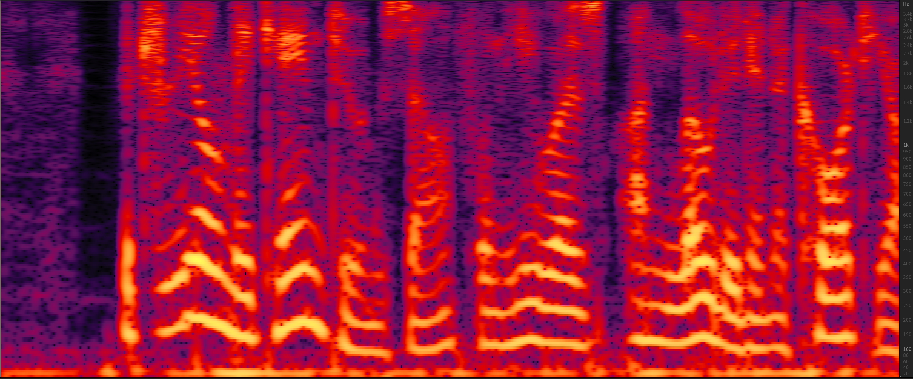 |
| **Z-SpEx**   <audio controls><source src="./data/diff_gen/case1/ours.wav" type="audio/wav">Your browser does not support the audio element.</audio> | **Ground truth**   <audio controls><source src="./data/diff_gen/case1/gt.wav" type="audio/wav">Your browser does not support the audio element.</audio> |
| 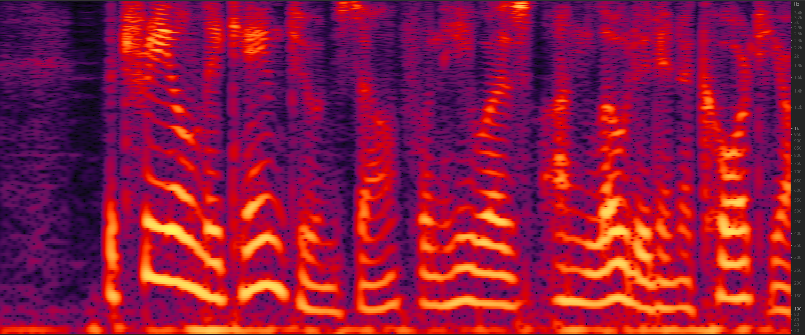 | 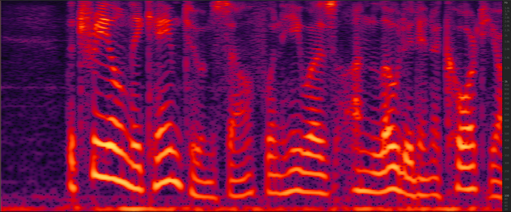 |

#### case 2

|                            case 2                            |                                                              |
| :----------------------------------------------------------: | :----------------------------------------------------------: |
| **Mixture**  <audio controls><source src="./data/diff_gen/case2/mix.wav" type="audio/wav">Your browser does not support the audio element.</audio> | **SpEx+**    <audio controls><source src="./data/diff_gen/case2/spex_plus.wav" type="audio/wav">Your browser does not support the audio element.</audio> |
| 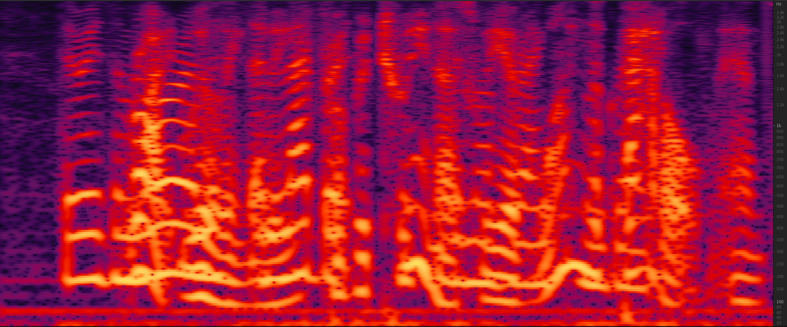 | 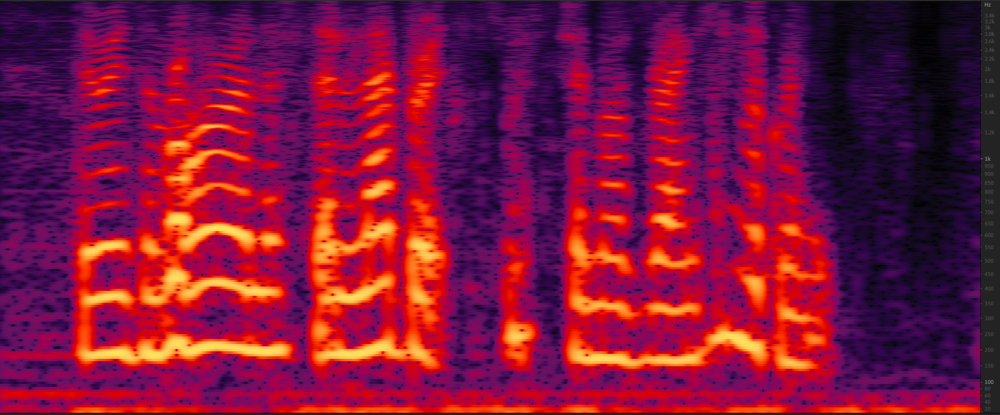 |
| **Z-SpEx**   <audio controls><source src="./data/diff_gen/case2/ours.wav" type="audio/wav">Your browser does not support the audio element.</audio> | **Ground truth**   <audio controls><source src="./data/diff_gen/case2/gt.wav" type="audio/wav">Your browser does not support the audio element.</audio> |
| 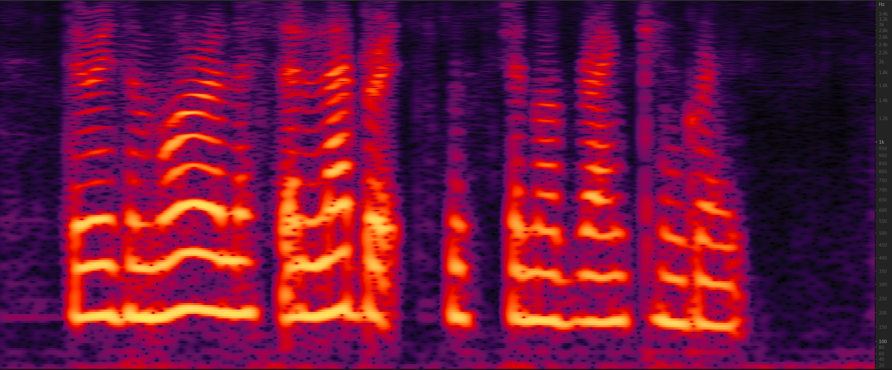 | 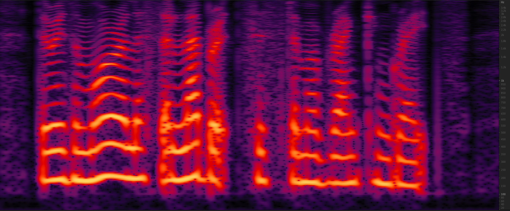 |

<h3 id = "3"> Same Gender</h3>

<h4 id = "4">Female mixed with female</h4>

|                   Female mixed with female                   |                                                              |
| :----------------------------------------------------------: | :----------------------------------------------------------: |
| **Mixture**   <audio controls><source src="./data/same_gen/female_female/mix.wav" type="audio/wav">Your browser does not support the audio element.</audio> | **SpEx+**    <audio controls><source src="./data/same_gen/female_female/spex_plus.wav" type="audio/wav">Your browser does not support the audio element.</audio> |
| 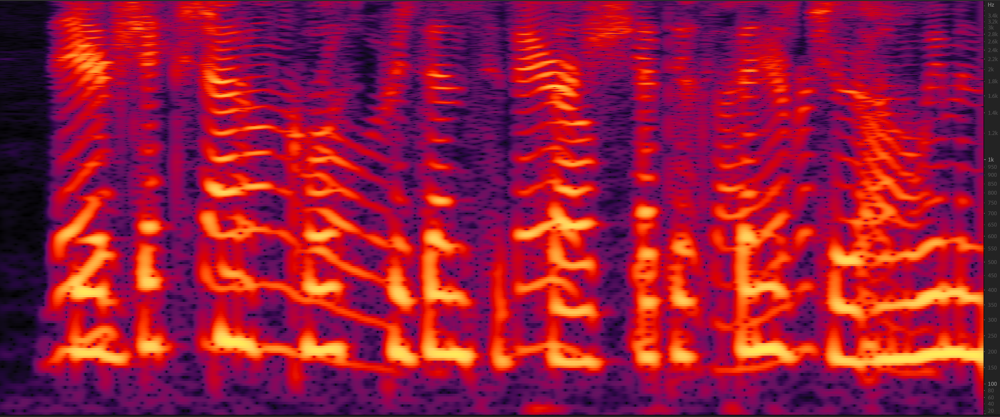 | 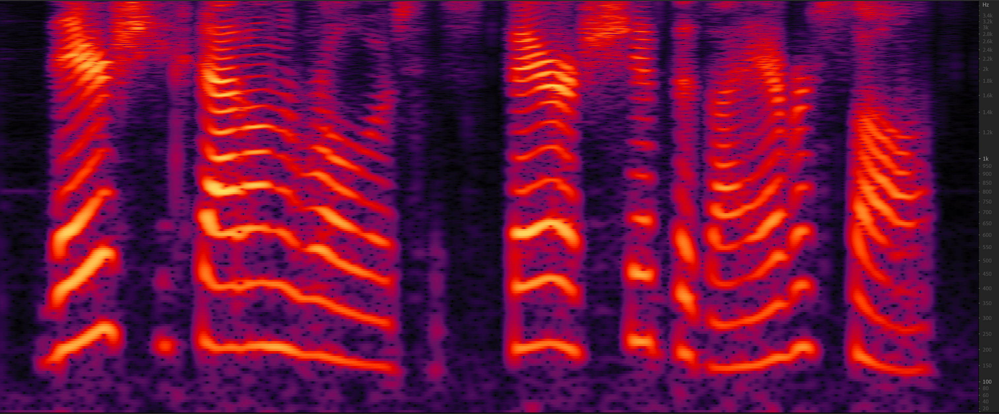 |
| **Z-SpEx**   <audio controls><source src="./data/same_gen/female_female/ours.wav" type="audio/wav">Your browser does not support the audio element.</audio> | **Ground truth**   <audio controls><source src="./data/same_gen/female_female/gt.wav" type="audio/wav">Your browser does not support the audio element.</audio> |
| 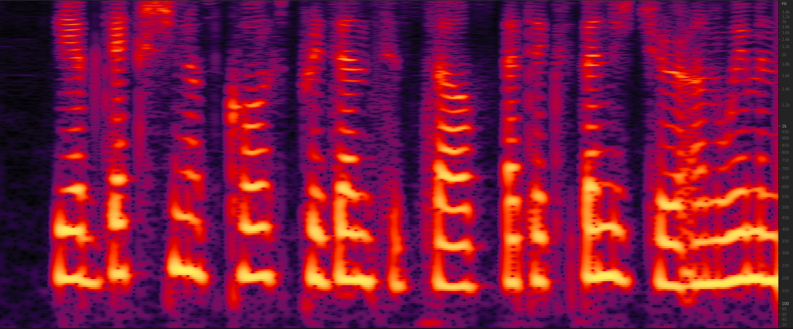 | 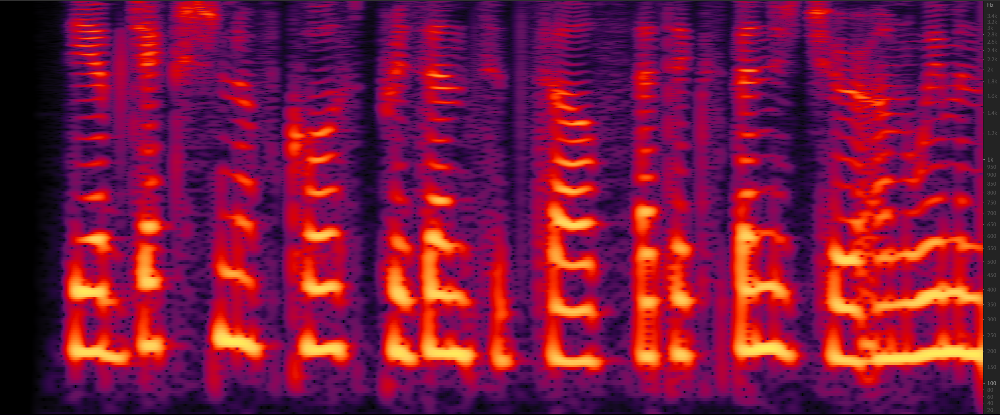 |

<h4 id = "3">Male mixed with male</h4>

|                     Male mixed with male                     |                                                              |
| :----------------------------------------------------------: | :----------------------------------------------------------: |
| **Mixture**   <audio controls><source src="./data/same_gen/male_male/mix.wav" type="audio/wav">Your browser does not support the audio element.</audio> | **SpEx+**    <audio controls><source src="./data/same_gen/male_male/spex_plus.wav" type="audio/wav">Your browser does not support the audio element.</audio> |
| 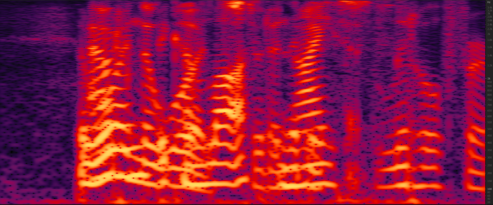 | 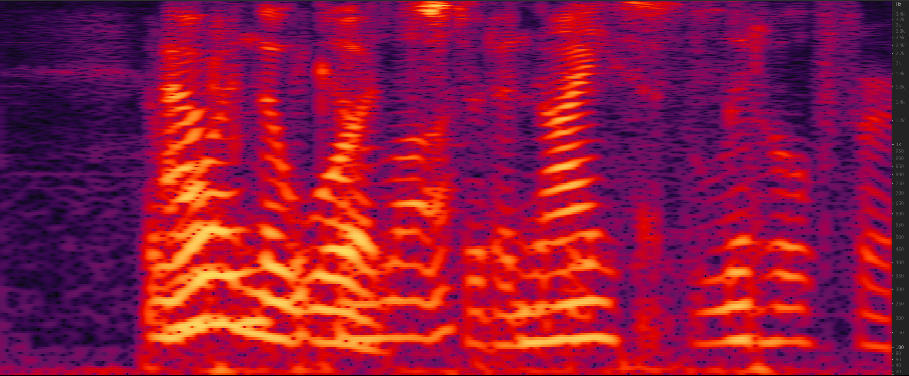 |
| **Z-SpEx**   <audio controls><source src="./data/same_gen/male_male/ours.wav" type="audio/wav">Your browser does not support the audio element.</audio> | **Ground truth**   <audio controls><source src="./data/same_gen/male_male/gt.wav" type="audio/wav">Your browser does not support the audio element.</audio> |
| 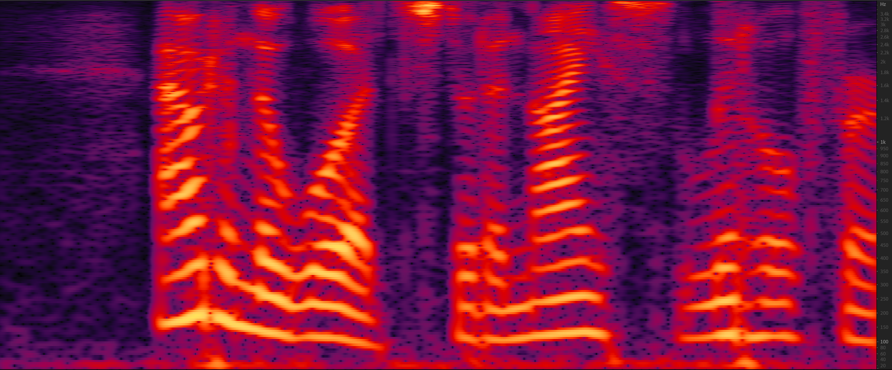 | 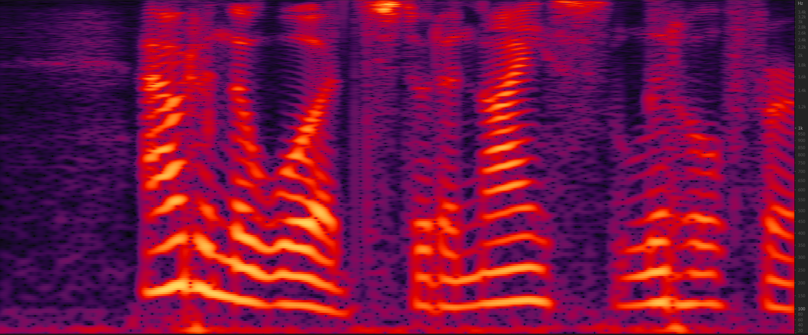 |
