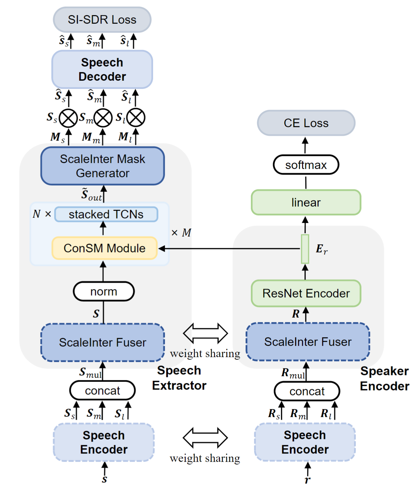

# Z-SpEx: Zero-shot Speaker Extraction with Multi-scale Interaction and Effective Cross-subnet Combination

### *Jun Chen, Wei Rao, Zilin Wang, Jiuxin Lin, Zhiyong Wu, Yukai Ju, Yannan Wang, Shidong Shang, Helen Meng*

<h2 id = "1">Abstract</h2>

Zero-shot speaker extraction aims at efficiently extracting the speech signal of an unseen speaker with only one reference utterance of the speaker. In this paper, we propose an extended speaker extraction framework called Z-SpEx with superior zero-shot capability. First, we present a multi-scale interaction (ScaleInter) fuser in Speaker Encoder to interactively fuse multi-scale features so as to improve the generalizability. In the same way, to enable the Speech Extractor to acquire greater generalization capacity, the ScaleInter fuser and ScaleInter mask generator are introduced to it for the interaction among multi-scale information. Furthermore, for the effective cross-subnet combination between Speech Extractor and Speaker Encoder, we share the weights of the ScaleInter fusers in them, as well as design a conditional speaker modulation (ConSM) module to effectively modulate and combine the features of these two subnets. Experimental results on the Libri2Mix dataset show that Z-SpEx yields a significant performance in extracting the speech signal of the unseen speaker and outperforms other state-of-the-art speech extraction approaches, which demonstrate the effectiveness of our improvements.

    
	
    
     
    
 Fig.1: The overall diagram of the Z-SpEx. The dotted border represents the module with shared weights. The "\(\otimes\)" means element-wise multiplication. The “SI-SDR Loss" and ”CE Loss" refer to the scale-invariant signal-to-distortion ratio loss and cross-entropy loss in multi-task learning
    

## Without Reverberation

<h3 id = "3"> case 1</h3>

|                          **case 1**                          |                                                              |
| :----------------------------------------------------------: | :----------------------------------------------------------: |
| **Noisy**  <audio controls><source src="./data/no_reverb/example245/noisy.wav" type="audio/wav">Your browser does not support the audio element.</audio> | **Subband model**    <audio controls><source src="./data/no_reverb/example245/Subband_model.wav" type="audio/wav">Your browser does not support the audio element.</audio> |
|  |  |
| **Inter-SubNet**   <audio controls><source src="./data/no_reverb/example245/Inter_SubNet.wav" type="audio/wav">Your browser does not support the audio element.</audio> | **Clean**   <audio controls><source src="./data/no_reverb/example245/clean.wav" type="audio/wav">Your browser does not support the audio element.</audio> |
|  |  |

<h3 id = "3"> case 2</h3>

|                          **case 2**                          |                                                              |
| :----------------------------------------------------------: | :----------------------------------------------------------: |
| **Noisy**  <audio controls><source src="./data/no_reverb/example110/noisy.wav" type="audio/wav">Your browser does not support the audio element.</audio> | **Subband model**    <audio controls><source src="./data/no_reverb/example110/Subband_model.wav" type="audio/wav">Your browser does not support the audio element.</audio> |
|  |  |
| **Inter-SubNet**   <audio controls><source src="./data/no_reverb/example110/Inter_SubNet.wav" type="audio/wav">Your browser does not support the audio element.</audio> | **Clean**   <audio controls><source src="./data/no_reverb/example110/clean.wav" type="audio/wav">Your browser does not support the audio element.</audio> |
|  |  |

<h3 id = "3"> case 3</h3>

|                          **case 3**                          |                                                              |
| :----------------------------------------------------------: | :----------------------------------------------------------: |
| **Noisy**   <audio controls><source src="./data/no_reverb/example38/noisy.wav" type="audio/wav">Your browser does not support the audio element.</audio> | **Subband model**    <audio controls><source src="./data/no_reverb/example38/Subband_model.wav" type="audio/wav">Your browser does not support the audio element.</audio> |
|  |  |
| **Inter-SubNet**   <audio controls><source src="./data/no_reverb/example38/Inter_SubNet.wav" type="audio/wav">Your browser does not support the audio element.</audio> | **Clean**   <audio controls><source src="./data/no_reverb/example38/clean.wav" type="audio/wav">Your browser does not support the audio element.</audio> |
|  |  |

<h3 id = "3"> case 4</h3>

|                          **case 4**                          |                                                              |
| :----------------------------------------------------------: | :----------------------------------------------------------: |
| **Noisy**   <audio controls><source src="./data/no_reverb/example213/noisy.wav" type="audio/wav">Your browser does not support the audio element.</audio> | **Subband model**   <audio controls><source src="./data/no_reverb/example213/Subband_model.wav" type="audio/wav">Your browser does not support the audio element.</audio> |
|  |  |
| **Inter-SubNet**   <audio controls><source src="./data/no_reverb/example213/Inter_SubNet.wav" type="audio/wav">Your browser does not support the audio element.</audio> | **Clean**   <audio controls><source src="./data/no_reverb/example213/clean.wav" type="audio/wav">Your browser does not support the audio element.</audio> |
|  |  |

## With Reverberation

<h3 id = "3"> case 1</h3>

|                          **case 1**                          |                                                              |
| :----------------------------------------------------------: | :----------------------------------------------------------: |
| **Noisy**  <audio controls><source src="./data/with_reverb/example38/noisy.wav" type="audio/wav">Your browser does not support the audio element.</audio> | **Subband model**    <audio controls><source src="./data/with_reverb/example38/Subband_model.wav" type="audio/wav">Your browser does not support the audio element.</audio> |
|  |  |
| **Inter-SubNet**   <audio controls><source src="./data/with_reverb/example38/Inter_SubNet.wav" type="audio/wav">Your browser does not support the audio element.</audio> | **Clean**   <audio controls><source src="./data/with_reverb/example38/clean.wav" type="audio/wav">Your browser does not support the audio element.</audio> |
|  |  |

<h3 id = "3"> case 2</h3>

|                          **case 2**                          |                                                              |
| :----------------------------------------------------------: | :----------------------------------------------------------: |
| **Noisy**  <audio controls><source src="./data/with_reverb/example110/noisy.wav" type="audio/wav">Your browser does not support the audio element.</audio> | **Subband model**    <audio controls><source src="./data/with_reverb/example110/Subband_model.wav" type="audio/wav">Your browser does not support the audio element.</audio> |
|  |  |
| **Inter-SubNet**   <audio controls><source src="./data/with_reverb/example110/Inter_SubNet.wav" type="audio/wav">Your browser does not support the audio element.</audio> | **Clean**   <audio controls><source src="./data/with_reverb/example110/clean.wav" type="audio/wav">Your browser does not support the audio element.</audio> |
|  |  |

<h3 id = "3"> case 3</h3>

|                          **case 3**                          |                                                              |
| :----------------------------------------------------------: | :----------------------------------------------------------: |
| **Noisy**   <audio controls><source src="./data/with_reverb/example245/noisy.wav" type="audio/wav">Your browser does not support the audio element.</audio> | **Subband model**    <audio controls><source src="./data/with_reverb/example245/Subband_model.wav" type="audio/wav">Your browser does not support the audio element.</audio> |
|  |  |
| **Inter-SubNet**   <audio controls><source src="./data/with_reverb/example245/Inter_SubNet.wav" type="audio/wav">Your browser does not support the audio element.</audio> | **Clean**   <audio controls><source src="./data/with_reverb/example245/clean.wav" type="audio/wav">Your browser does not support the audio element.</audio> |
|  |  |

<h3 id = "3"> case 4</h3>

|                          **case 4**                          |                                                              |
| :----------------------------------------------------------: | :----------------------------------------------------------: |
| **Noisy**   <audio controls><source src="./data/with_reverb/example206/noisy.wav" type="audio/wav">Your browser does not support the audio element.</audio> | **Subband model**    <audio controls><source src="./data/with_reverb/example206/Subband_model.wav" type="audio/wav">Your browser does not support the audio element.</audio> |
|  |  |
| **Inter-SubNet**   <audio controls><source src="./data/with_reverb/example206/Inter_SubNet.wav" type="audio/wav">Your browser does not support the audio element.</audio> | **Clean**   <audio controls><source src="./data/with_reverb/example206/clean.wav" type="audio/wav">Your browser does not support the audio element.</audio> |
|  |  |
